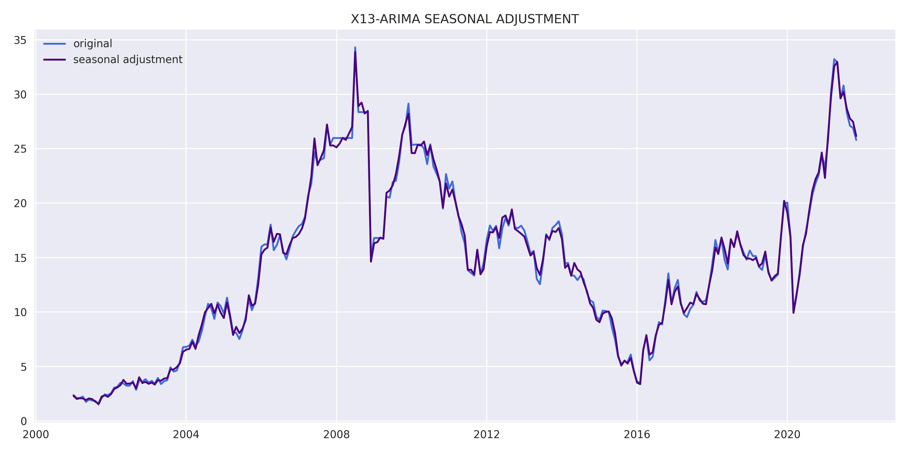
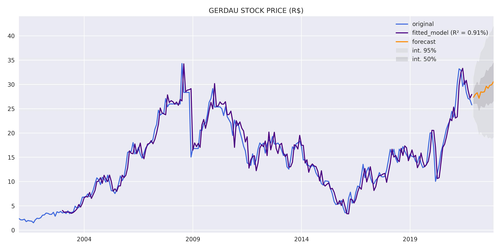

# **DESCRIPTION**
Gerdau is the largest producer of long steel in Latin America, with steel mills in Brazil, Argentina, Canada, Colombia, Dominican Republic, Mexico, Peru, United States, Uruguay and Venezuela. Currently, Gerdau has an installed capacity of 26 million metric tons of steel per year and offers steel for the civil construction, automobile, industrial, agricultural and various sectors. Gerdau is also the world’s 30th largest steelmaker. It has 337 industrial and commercial units and more than 30,000 employees across 10 countries.
Gerdau produces long carbon steel, long special steel, flat steel and forged and cast parts. These products are used in different sectors, such as industry, metallurgy, farming and livestock, civil construction, automotive industries, petrochemicals, railway and naval sectors, in addition to orthodontic, medical and food areas. Gerdau is also the main supplier of specialty steel for the international automotive network.

Data source: https://finance.yahoo.com/quote/GGBR4.SA?p=GGBR4.SA

# **RESULTS**
Results obtained through the model estimation process.

## Variable analysis at level:
    

    

    

    

## Study of data stationarity:
    

    

## SEASONAL ADJUSTMENT:
    

    

## Model results:
    

## Residual analysis:
    

    

    

# FORECAST:
    
